# Engine — Architectural Reference

> **AI-native code editor.** AI is not bolted onto a text editor — it is the foundational architecture. Every feature is designed around AI-driven workflows.
>
> **Clarification:** Engine now uses a **first-party editor core**. **Tauri is only the desktop shell / process container** around the client and Go sidecar. It is not the editor engine.

---

## Table of Contents

1. [High-Level System Architecture](#1-high-level-system-architecture)
2. [Package Dependency Graph](#2-package-dependency-graph)
3. [UI Component Tree](#3-ui-component-tree)
4. [Chat & AI Tool Use Flow](#4-chat--ai-tool-use-flow)
5. [File & Git Operation Flow](#5-file--git-operation-flow)
6. [Terminal Data Flow](#6-terminal-data-flow)
7. [Desktop App Startup Sequence](#7-desktop-app-startup-sequence)
8. [Session & Database Model](#8-session--database-model)
9. [Build Pipeline](#9-build-pipeline)
10. [CI/CD Pipeline](#10-cicd-pipeline)
11. [Tech Stack](#11-tech-stack)
12. [Implementation Status](#12-implementation-status)
13. [Roadmap](#13-roadmap)
14. [Key Design Decisions](#14-key-design-decisions)

---

## 1. High-Level System Architecture

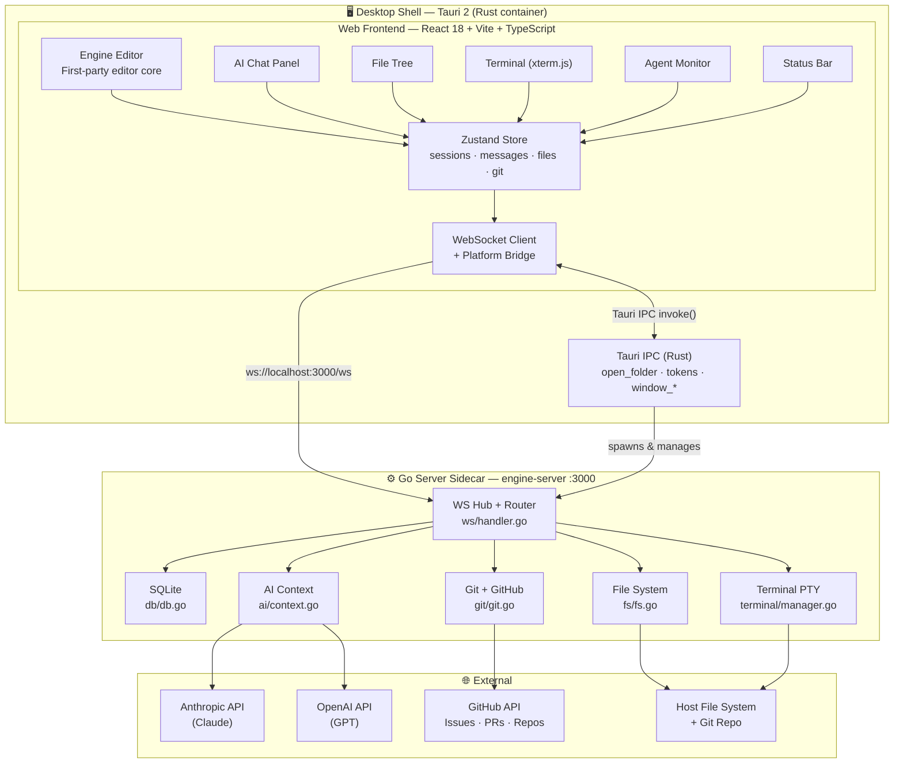

---

## 2. Package Dependency Graph

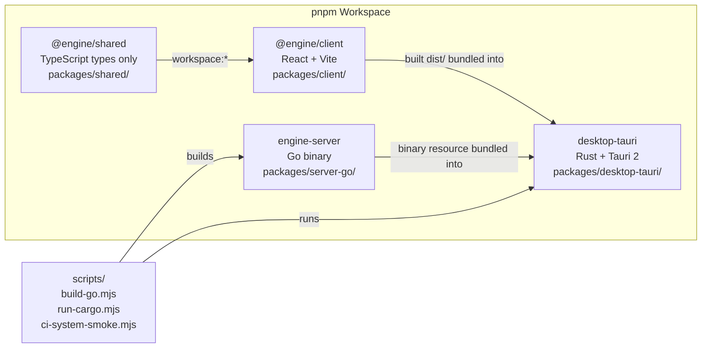

---

## 3. UI Component Tree

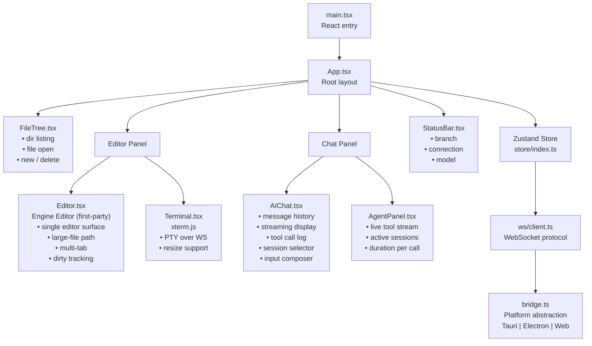

---

## 4. Chat & AI Tool Use Flow

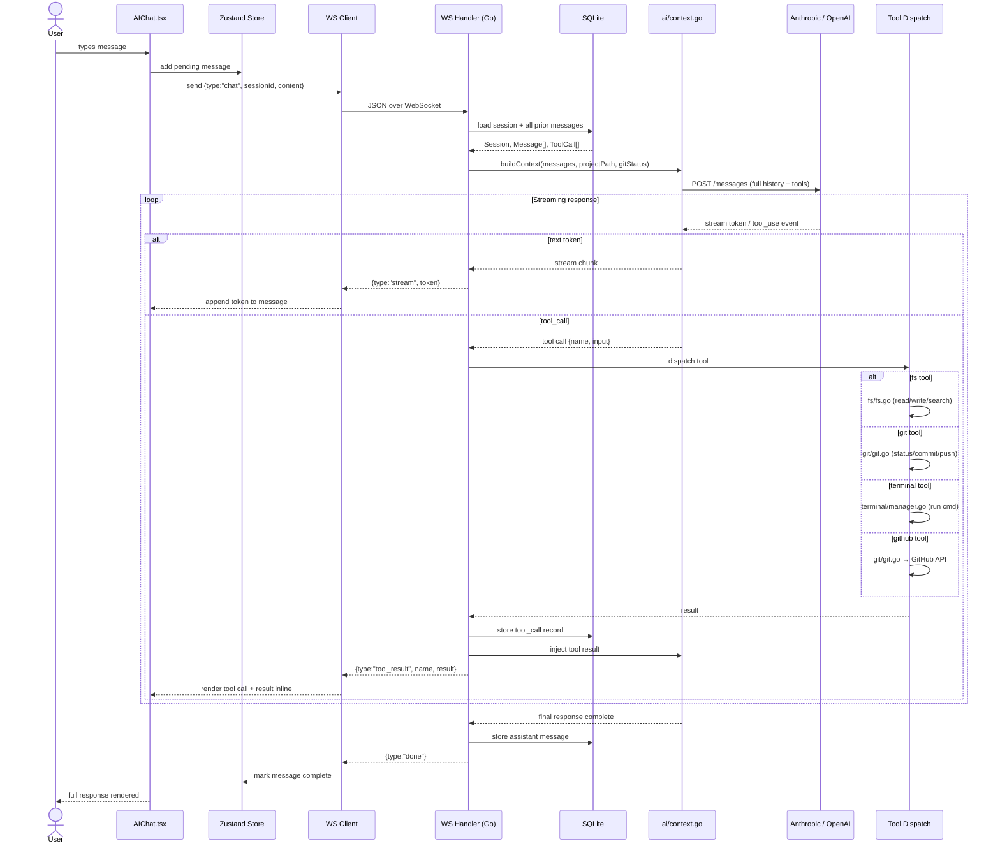

---

## 5. File & Git Operation Flow

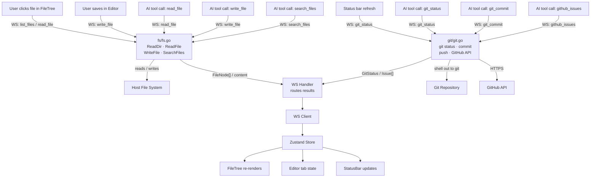

---

## 6. Terminal Data Flow

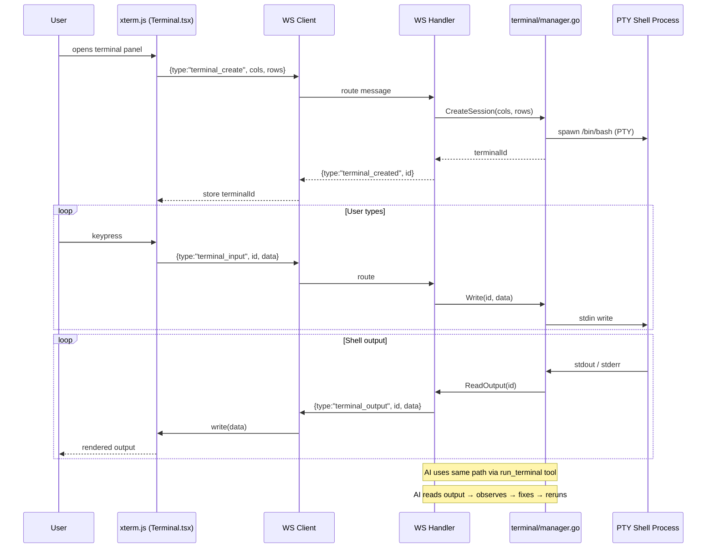

---

## 7. Desktop App Startup Sequence

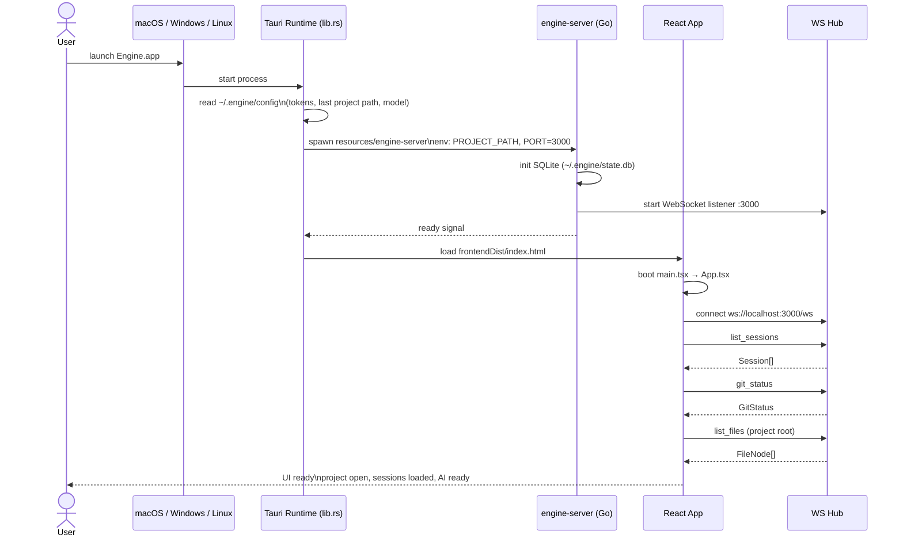

---

## 8. Session & Database Model

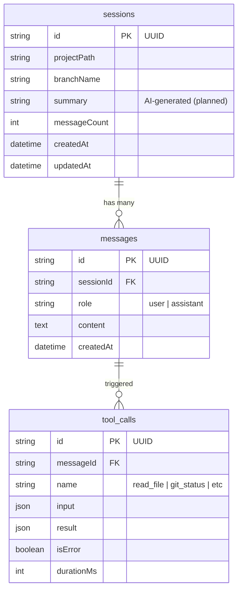

---

## 9. Build Pipeline

```mermaid
flowchart TD
    subgraph Dev["pnpm dev (no Tauri)"]
        D1["build-go.mjs --dev --run\n→ engine-server :3000"]
        D2["pnpm --filter client dev\n→ Vite HMR :5173"]
        D1 & D2 -->|concurrently| D3["Dev environment ready"]
    end

    subgraph DevTauri["pnpm dev:tauri"]
        T1["build-go.mjs (sidecar)"]
        T2["client dev :5173"]
        T3["run-cargo.mjs tauri dev\nloads devUrl: localhost:5173"]
        T1 & T2 --> T3
    end

    subgraph Prod["pnpm build:tauri (production)"]
        P1["pnpm --filter shared build\ntsc → shared/dist/"]
        P2["build-go.mjs\ngo build → engine-server binary"]
        P3["pnpm --filter client build\nvite build → client/dist/"]
        P4["run-cargo.mjs tauri build\nbundles everything"]
        P5["Output: .app / .exe / .deb / .AppImage\n(engine-server embedded as resource)"]

        P1 --> P2
        P2 --> P3
        P3 --> P4
        P4 --> P5
    end

    subgraph Smoke["pnpm smoke:system"]
        S1["ci-system-smoke.mjs"]
        S2["Launch built binary"]
        S3["Wait for server ready"]
        S4["Test WS connection"]
        S5["Test basic operations"]
        S6["Assert responses"]
        S7["Cleanup"]
        S1 --> S2 --> S3 --> S4 --> S5 --> S6 --> S7
    end
```

---

## 10. CI/CD Pipeline

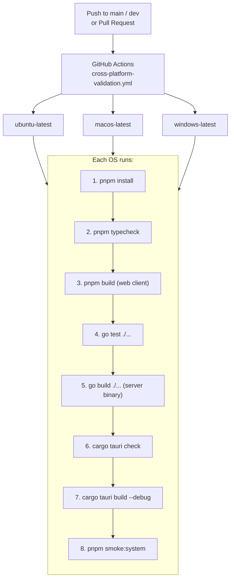

---

## 11. Tech Stack

| Layer | Technology | Version | Why |
|---|---|---|---|
| Frontend framework | React | 18.3.1 | Component model for complex UI |
| Build tool | Vite | 6.2.6 | Fast HMR, native ESM |
| Language (frontend) | TypeScript | 5.8.0 | Type safety across WS protocol |
| State management | Zustand | 5.0.3 | No boilerplate, simple, scalable |
| Code editor component | Engine editor core | First-party | Single editor surface tuned directly for Engine and large-file control |
| Terminal component | xterm.js | 5.5.0 | Battle-tested PTY terminal |
| Styling | Tailwind CSS | 3.4.17 | Utility-first, no CSS file sprawl |
| Icons | lucide-react | 0.487.0 | Clean SVG icon set |
| Backend language | Go | 1.26.1 | Concurrency, fast startup, single binary |
| WebSocket server | gorilla/websocket | 1.5.3 | Proven WS library for Go |
| Database | SQLite (modernc) | 1.48.1 | Embedded, zero ops, persistent sessions |
| PTY | creack/pty | 1.1.24 | PTY creation for Unix/macOS |
| Desktop framework | Tauri | 2 | Rust shell, tiny bundle, no Node runtime |
| Desktop language | Rust | stable | Memory safe, Tauri ecosystem |
| AI APIs | Anthropic + OpenAI | — | Multi-provider (Claude + GPT) |
| Package manager | pnpm | 10.28.1 | Fast, workspace support |

---

## 12. Implementation Status

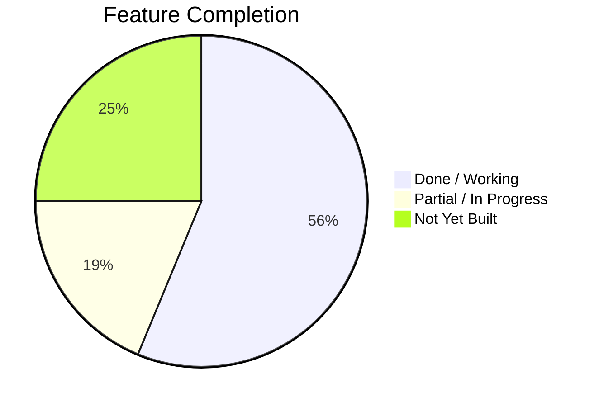

### ✅ Done / Working

| Feature | Package |
|---|---|
| WebSocket server hub + message routing | `server-go/ws` |
| SQLite sessions / messages / tool_calls | `server-go/db` |
| File system read / write / list / search | `server-go/fs` |
| Git status, branch, commit info | `server-go/git` |
| Terminal PTY (Unix + Windows) | `server-go/terminal` |
| Anthropic (Claude) streaming + tool use | `server-go/ai` |
| OpenAI (GPT) streaming + tool use | `server-go/ai` |
| React UI scaffold + layout | `client` |
| First-party editor core (single text surface, large-file path) | `client/Editor` |
| xterm.js terminal (PTY over WS) | `client/Terminal` |
| File tree (listing + open) | `client/FileTree` |
| AI chat (history + streaming) | `client/AIChat` |
| Agent monitor (live tool call view) | `client/AgentPanel` |
| Zustand store (all UI state) | `client/store` |
| Platform bridge (Tauri + web) | `client/bridge` |
| Shared TypeScript type definitions | `shared` |
| Tauri IPC / server lifecycle / window mgmt | `desktop-tauri` |
| CI matrix (Ubuntu / macOS / Windows) | `.github/workflows` |

### 🔶 Partial / In Progress

| Feature | Gap |
|---|---|
| Git commit / push / pull UI flow | Needs end-to-end testing |
| GitHub Issues integration | API exists in Go; no live issue → AI trigger loop |
| Session summary auto-generation | Schema has `summary` field; not yet generated by AI |
| Agent orchestration | AgentPanel renders; multi-agent dispatch not wired |
| Error recovery / reconnect | Basic handling; edge cases not covered |
| Mobile / remote access | Web client works in theory; not hardened |

### ❌ Not Yet Built

| Feature | Priority |
|---|---|
| Project direction summarization (auto-maintained across sessions) | 🔴 HIGH |
| Live GitHub issue → AI notification + task pickup | 🔴 HIGH |
| Multi-agent orchestration (coordinator + workers) | 🔴 HIGH |
| Behavioral validation loop (AI runs app, observes, fixes, reruns) | 🔴 HIGH |
| Settings UI (model picker, token management in-app) | 🟡 MEDIUM |
| Authentication for remote access | 🟡 MEDIUM |
| Mobile-responsive UI layout | 🟡 MEDIUM |
| Extension / plugin system | 🟢 LOW |

---

## 13. Roadmap

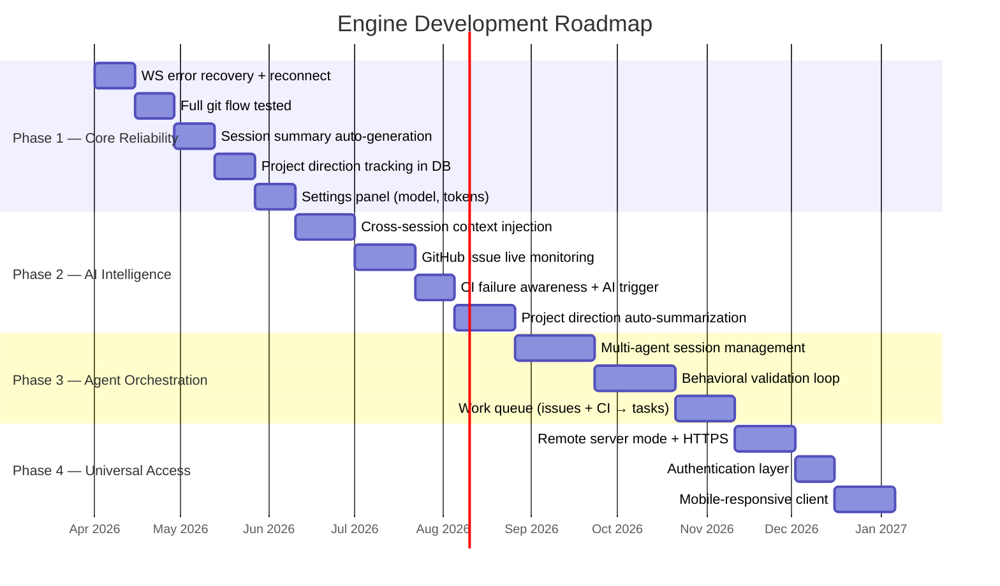

---

## 14. Key Design Decisions

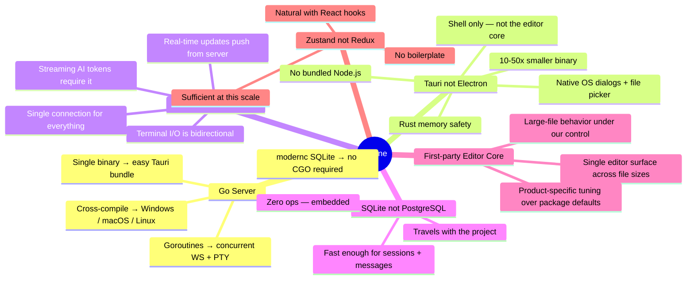

---

*Source of truth: this document + code. When they conflict, code wins.*
